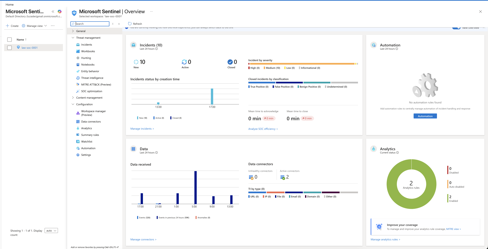
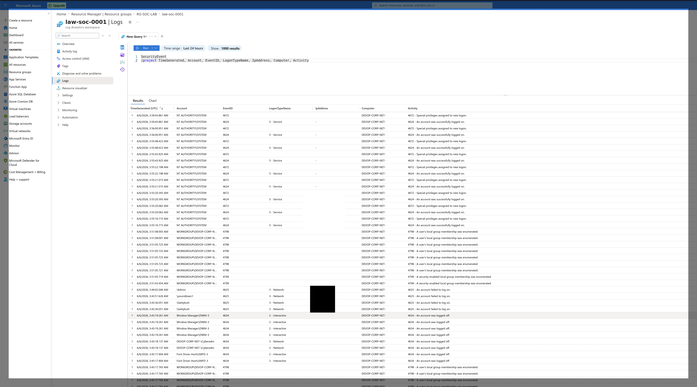
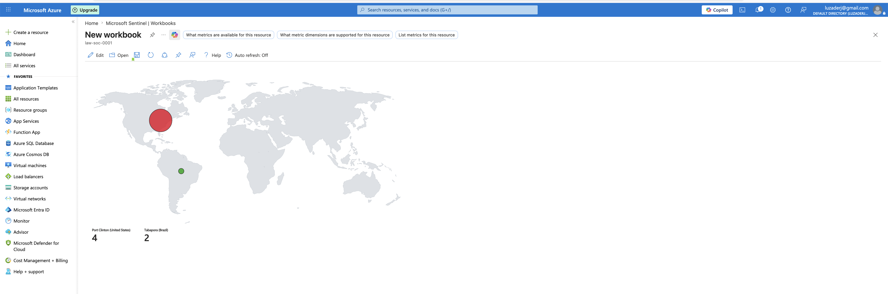
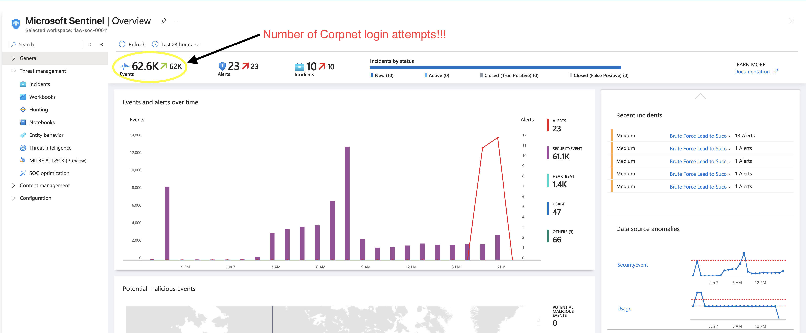
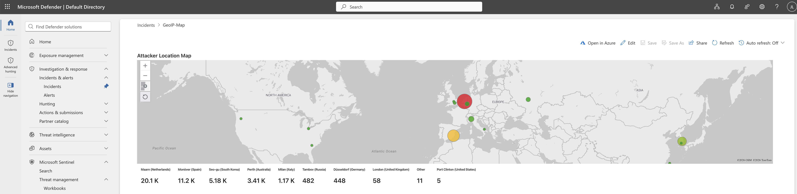
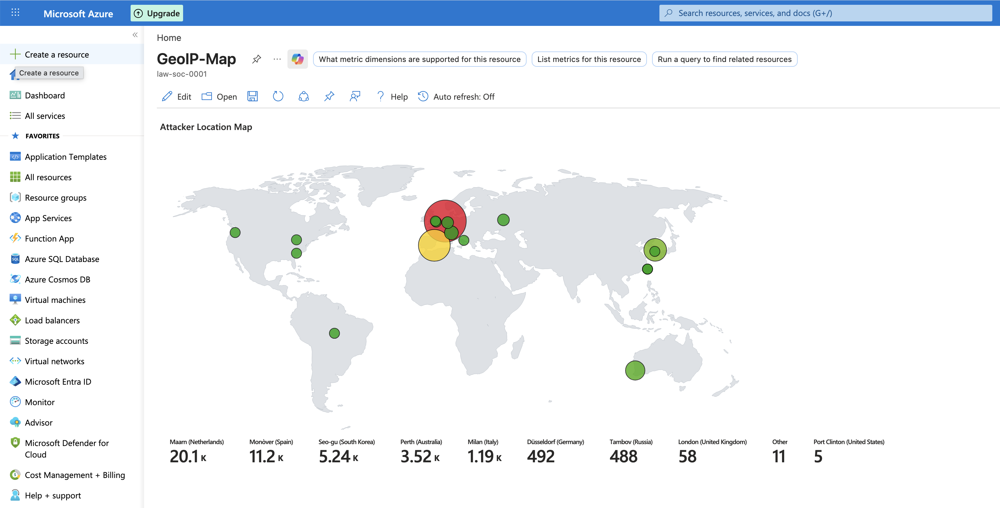

# 🛡️ Azure Cloud Honeypot: Live Threat Intelligence with Microsoft Sentinel SIEM

> Deployed a deliberately exposed corporate developer endpoint in Azure, ingested logs into Microsoft Sentinel, wrote KQL to detect and geolocate threat actors, and watched over 60,000 real brute-force attempts pour in from around the world — within 18 hours.


---

## 📌 Overview

This lab simulates a real-world scenario: an exposed corporate developer machine with no network perimeter controls. Using a **free Azure trial account**, I:

- Deployed a Windows VM configured to look like a corporate developer endpoint (`DEVOP-CORP-NET`)
- Disabled all host-based firewall rules to maximize attack surface
- Connected the VM to **Microsoft Sentinel** via a **Log Analytics Workspace**
- Wrote **KQL (Kusto Query Language)** queries to extract, filter, and correlate failed login events
- Used a **custom Sentinel Workbook** to geographically map attacker IP addresses in real time

**The takeaway:** Within 8 hours of deployment, the first attack landed. Within 18 hours, over **100,000 login attempts** arrived from 15+ countries — all against a single machine that hadn't been publicly advertised anywhere.

---

## 🎯 Objectives

- Deploy and intentionally expose an Azure virtual machine to internet threat actors
- Configure Microsoft Sentinel to ingest and aggregate VM security event logs
- Write KQL queries to detect, filter, and analyze brute-force login attempts (Event ID 4625)
- Build a geolocation workbook to visualize attacker origin by IP address
- Measure attack velocity on a deliberately vulnerable internet-facing endpoint

---

## 🧰 Tools & Technologies

`Microsoft Azure` · `Microsoft Sentinel` · `Log Analytics Workspace (KQL)` · `Windows Event Viewer` · `GeoIP Workbook` · `Microsoft Defender for Cloud`

---

## 🖥️ Lab Architecture

```text
┌─────────────────────────────────────────────────────────────────────────┐
│                                                                         │
│  AZURE SUBSCRIPTION (Free Trial)                                        │
│  └── Resource Group: RG-SOC-LAB                                         │
│       ├── Virtual Machine: DEVOP-CORP-NET (Windows)                     │
│       │    ├── Firewall: DISABLED (all inbound rules removed)           │
│       │    ├── RDP Port 3389: OPEN to internet                          │
│       │    └── Credentials: 14-character complex password               │
│       │                                                                 │
│       ├── Log Analytics Workspace: law-soc-0001                         │
│       │    └── Data Connector: Windows Security Events                  │
│       │         └── Streaming: SecurityEvent table (EventID 4625, 4624) │
│       │                                                                 │
│       └── Microsoft Sentinel                                            │
│            ├── Analytics Rules: Brute Force Detection                   │
│            ├── KQL Queries: Custom login-failure correlation            │
│            └── Workbook: GeoIP-Map (attacker location visualization)    │
│                                                                         │
└─────────────────────────────────────────────────────────────────────────┘
```

---

## 📐 Key KQL Query

The following query was used to extract all security login events and project them into the Sentinel workspace for analysis and geolocation correlation:

```kql
SecurityEvent
| project TimeGenerated, Account, EventID, LogonTypeName, IpAddress, Computer, Activity
```

This query filters the `SecurityEvent` table and projects only the relevant fields — timestamp, account name, event ID, logon type, source IP address, hostname, and activity description — into a clean result set for threat analysis.

**Key Event IDs monitored:**

| Event ID | Meaning |
|---|---|
| `4625` | An account **failed** to log on — brute force indicator |
| `4624` | An account **successfully** logged on |
| `4672` | Special privileges assigned to new logon |
| `4798` | A user's local group membership was enumerated |
| `4799` | A security-enabled local group membership was enumerated |

---

## 🪜 Walkthrough

### Phase 1 — Infrastructure Deployment

Provisioned a fresh Azure free trial account and created a resource group `RG-SOC-LAB`. Deployed a Windows virtual machine named `DEVOP-CORP-NET` — intentionally named to resemble a real enterprise corporate developer endpoint.

**Credential configuration:**
- Username: standard naming convention
- Password: **14-character complex password** — the goal was to have attackers hammering the door without ever getting in, creating maximum log volume for analysis

**Attack surface configuration:**
- Removed all Windows Firewall inbound rules on the VM
- Left RDP (port 3389) fully exposed to the public internet
- No Network Security Group (NSG) restrictions — the machine was effectively naked on the internet

### Phase 2 — Sentinel Pipeline Setup

Connected the VM to a **Log Analytics Workspace** (`law-soc-0001`) using the Windows Security Events data connector. This pipes all Windows security log events into Azure's log store in real time.

Configured Microsoft Sentinel on top of that workspace, enabling:
- **Analytics rules** for brute-force detection
- **SecurityEvent** table ingestion
- Two active **data connectors**

> **8 hours after deployment:** The first attack event landed. No announcement. No public listing. The attackers found it through automated internet scanning.

### Phase 3 — Initial Log Observation

Opened the Log Analytics workspace and ran the KQL query against the `SecurityEvent` table. Immediately visible: repeated **Event 4625 (failed logon)** entries from external IP addresses attempting to authenticate with common usernames — `\Admin`, `\poundtown1`, `\Gettybutt`, `\Cyberadm` — classic credential-stuffing patterns against guessed administrator account names.

Windows Event Viewer on the VM confirmed the same — hundreds of Event 4625 entries every few minutes, logon type 3 (network), all targeting the `Admin` account from external IPs.

### Phase 4 — Sentinel Dashboard: Incident Trigger

Within the first monitoring window, Sentinel registered **10 incidents** — all classified as **"Brute Force Lead to Success"** (alert: repeated failures from same source IP within threshold). At this stage:

- Events ingested: ~326 in first 24-hour window (early deployment)
- Active analytics rules: 2 (brute force detection)
- Incidents: 10 new / 0 closed
- Mean time to acknowledge: 0 min (no active SOC response — monitoring only)

### Phase 5 — Attack Velocity Explodes

By **18 hours post-deployment**, the Sentinel overview showed:

- **62.6K events** ingested
- **23 alerts** fired
- **10 active incidents** — all brute-force related
- SecurityEvent table alone: **61.1K entries**

The Sentinel event timeline showed massive spikes starting overnight and peaking around 6 AM–9 AM the following morning — consistent with automated scanning infrastructure that runs on schedule regardless of timezone.

### Phase 6 — Geolocation Mapping

Built a custom **Sentinel Workbook** using the GeoIP-Map template, correlating source IP addresses from failed login events to geographic origin. The attack map revealed a globally distributed attack surface — no single nation-state actor, but a wide array of automated scanning infrastructure distributed across commercial hosting providers worldwide.

**Top attacker origins by event count (18-hour window):**

| Country | Events |
|---|---|
| 🇳🇱 Maarn, Netherlands | 20,100 |
| 🇪🇸 Monóver, Spain | 11,200 |
| 🇰🇷 Seo-gu, South Korea | 5,240 |
| 🇦🇺 Perth, Australia | 3,520 |
| 🇮🇹 Milan, Italy | 1,190 |
| 🇩🇪 Düsseldorf, Germany | 492 |
| 🇷🇺 Tambov, Russia | 488 |
| 🇬🇧 London, United Kingdom | 58 |
| 🇧🇷 Tabapora, Brazil | 11 |
| 🇺🇸 Port Clinton, United States | 5 |

> Note: "Port Clinton, United States" with 5 events is the local origin — my own connection activity appearing in the log. Everything else is inbound threat traffic.

### Phase 7 — Reflection & Teardown

VM was deprovisioned after the 18-hour observation window. All resources deleted to avoid unexpected billing on the free trial account. Log data was preserved in the workspace for analysis.

---

## 📸 Screenshots

### Sentinel Overview — Initial Incident Trigger

> 10 incidents generated within the first monitoring window. 326 events ingested. Brute-force analytics rules firing.



---

### KQL Query — Log Injection Start

> Running the SecurityEvent KQL query against the Log Analytics Workspace. Failed logon events (4625) visible from accounts including `\Admin`, `\poundtown1`, `\Gettybutt` — classic credential-stuffing targets.



---

### Early Attack Map — Hours 1–8

> Sentinel Workbook GeoIP map early in the observation window. Attack traffic beginning to register — Port Clinton (US): 4 events (my own activity), Tabapora (Brazil): 2 events. The calm before the storm.



---

### Sentinel Overview — 62.6K Events

> 18 hours in. 62,600 events ingested. 23 alerts. 10 active incidents — all "Brute Force Lead to Success." The annotation shows the sheer volume of corporate network login attempts. SecurityEvent table alone: 61.1K entries.



---

### Full Attack Map — Microsoft Defender View

> GeoIP map showing attacker origin distribution at peak. Netherlands leading with 20.1K events, Spain 11.2K, South Korea 5.18K. The large red circle over Western Europe represents the dominant attack cluster. Automated scanning infrastructure — not manual attempts.



---

### Full Attack Map — Azure Sentinel Workbook View

> Same data in the Sentinel Workbook view. Global distribution confirms this is automated botnet/scanner activity — no single origin, no specific targeting. Opportunistic scanning that found the open port through routine internet sweeps.



---

### Windows Event Viewer — Event ID 4625

> Direct confirmation on the VM itself. Windows Event Viewer Security log showing Event 4625 — "An account failed to log on" — targeting the `Admin` account via network logon (Type 3) from external IPs. 859 security events visible in this snapshot alone.


---

## 🎯 MITRE ATT&CK Mapping

| ID | Tactic | Technique | How it appeared in this lab |
|----|--------|-----------|------------------------------|
| `T1190` | Initial Access | Exploit Public-Facing Application | RDP (port 3389) exposed to internet; actively probed within 8 hours |
| `T1110.001` | Credential Access | Brute Force: Password Guessing | Repeated Event 4625s targeting `Admin`, common usernames — 100K+ attempts |
| `T1110.003` | Credential Access | Brute Force: Password Spraying | Multiple usernames attempted from same source IPs across the network logon window |
| `T1078` | Defense Evasion / Persistence | Valid Accounts | Attackers targeting `Admin` and common account names to gain legitimate-looking access |
| `T1021.001` | Lateral Movement | Remote Services: Remote Desktop Protocol | RDP was the primary attack vector — all failed logons via Type 3 network logon |
| `T1590` | Reconnaissance | Gather Victim Network Information | Automated internet scanners identified open RDP port without any direct targeting |

---

## 🧠 What I Learned

**Speed of exposure:** An internet-facing machine with open RDP is found by automated scanners in hours — not days. There is no grace period. Assume any open port is being probed immediately.

**Credential hygiene is the last line:** The only reason no attacker succeeded was the 14-character complex password. No firewall. No NSG. No MFA. Just one strong credential standing between 100,000 attempts and a full compromise.

**KQL is a powerful investigation tool:** Writing queries against the `SecurityEvent` table to filter, project, and correlate fields is immediately applicable to real SOC work. The ability to pivot from Event ID → Account → IP → Geolocation in a single query chain demonstrates why KQL literacy is a core SOC analyst skill.

**SIEM visibility is everything:** Without Sentinel ingesting those logs, all 62,600 events would have been invisible noise on a VM nobody was watching. The pipeline from endpoint → Log Analytics → Sentinel → Workbook is the exact architecture used in enterprise SOCs.

**Aviation parallel:** In aircraft maintenance, we monitored engine health parameters continuously — not because we expected a failure on every flight, but because when something went wrong, we needed the data to trace it. SIEM is the same discipline. You build the monitoring infrastructure before you need it.

---

## 🛠️ Skills Demonstrated

- **Azure cloud deployment** — VM provisioning, resource group management, subscription configuration
- **Microsoft Sentinel** — workspace configuration, data connector setup, analytics rule management
- **KQL (Kusto Query Language)** — writing queries to filter, project, and analyze security event data
- **SIEM operations** — alert triage, incident review, event correlation
- **Threat intelligence** — geolocation of attacker IPs, pattern recognition across event logs
- **Windows Security Events** — interpreting Event IDs 4624/4625/4672/4798 in a live environment
- **Workbook development** — building GeoIP visualization dashboards in Sentinel

---

## 💼 Resume Bullets

- Deployed and operated a live Azure honeypot using Microsoft Sentinel SIEM, capturing 62,600+ real-world attack events from 15+ countries within 18 hours
- Authored KQL queries against the `SecurityEvent` table to detect, filter, and correlate brute-force login attempts (Event ID 4625) across a live threat feed
- Built a custom Sentinel GeoIP Workbook to visualize attacker origin data, revealing distributed automated scanning infrastructure across Netherlands, Spain, South Korea, Australia, and Russia
- Documented full attack lifecycle from open-port discovery through credential-stuffing campaign using Windows Event Viewer, Log Analytics, and Microsoft Defender for Cloud

---

## 🔗 References

- [Microsoft Sentinel Documentation](https://learn.microsoft.com/en-us/azure/sentinel/)
- [KQL (Kusto Query Language) Reference](https://learn.microsoft.com/en-us/azure/data-explorer/kusto/query/)
- [Windows Security Event ID Reference](https://learn.microsoft.com/en-us/windows/security/threat-protection/auditing/event-4625)
- [MITRE ATT&CK Framework](https://attack.mitre.org/)
- [Microsoft Sentinel GeoIP Workbook](https://github.com/Azure/Azure-Sentinel/tree/master/Workbooks)

---

## 👤 About Me

I'm **Jonathan Luzader**, a cybersecurity student and former aircraft maintenance professional building public proof-of-skill through hands-on labs and documented writeups.

> *"Precision matters just as much in a KQL query as it does on a Boeing 767 flightline. You're always tracing a fault back to its source."*

- 🌐 GitHub: [@darthloozader](https://github.com/darthloozader)
- 🔗 LinkedIn: [jonathan-luzader](https://linkedin.com/in/jonathan-luzader)
- 📂 More projects: see my [pinned repositories](https://github.com/darthloozader)

---

## 📝 License

MIT — see [LICENSE](LICENSE).

---
